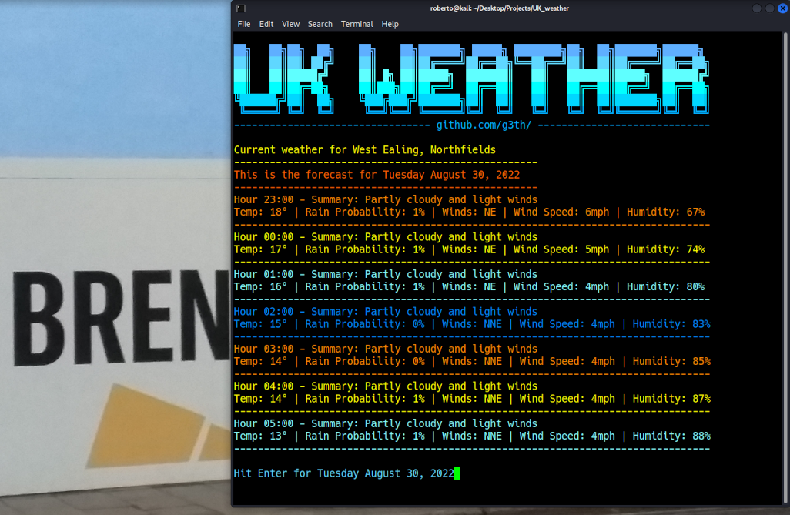

# UK Weather
## Weather Forecast For Linux Terminals
### Get your local weather when you first log on, without opening a browser.

Enter your post-code in the format requested, and get your local weather in your favourite linux/gnome terminal courtesy of the BBC api endpoint.

Will display the variables considered most relevant, like temperature, wind and rain probability.

If an invalid postcode is entered the program will return an error. Moreover, if an inactive postcode is entered, the search will time-out and the program will inform the user.

Requires BeautifulSoup.

