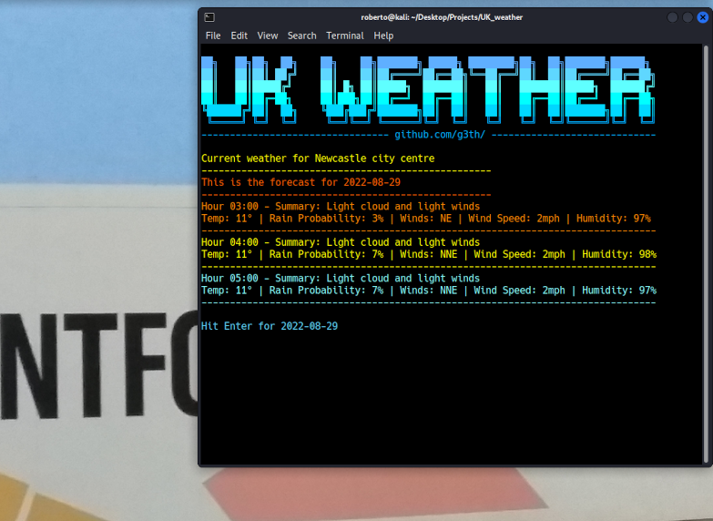

# UK Weather
## Find your local weather from a linux terminal

Enter your postcode and get a local weather report, using the BBC weather api endpoint.

At the moment, it will display a slight summary of the current weather hourly, including temperature.
